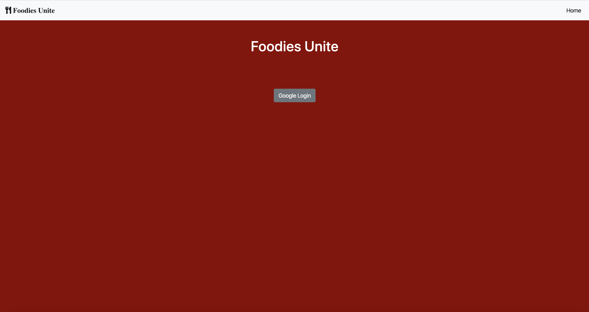
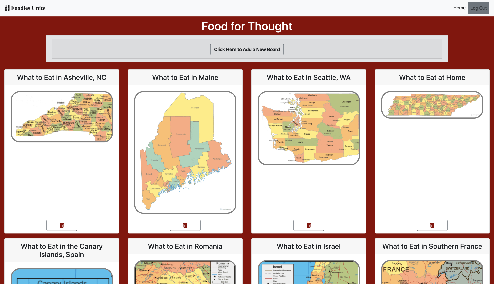
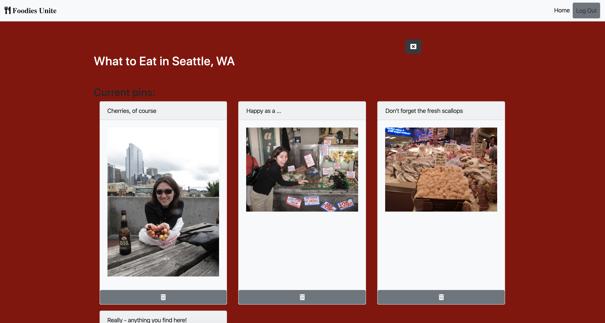

# A Foodie's Connection

## Description
This project is an exploration into using a Firebase database for user authentication and data management. It is a site similar to a much simplified vesion of Pinterest, and it includes meal recommendations for various places around the US and the world. Instructions can be found [here](https://github.com/nss-nightclass-projects/exercise-vault/blob/master/FIREBASE_pinterest.md).

## Screenshots
##### Home Login Page

##### Boards Page

###### Single Board View Page (with Pins)

## Features
1. Users are authenticated via Google login. 
1. Users can have view multiple boards. 
1. Users can view only their boards; they cannot view other users' boards.
1. Users can access an individual view for each board, which displays all the pins associated with that board. 
1. Users can delete boards, which also deletes all the pins associated with the corrsponding board. 
1. Users can delete individual pins. 

## How to Run
1. Clone down this repo.
1. Make sure you have http-server installed via npm. If not, get it [here](https://www.npmjs.com/package/http-server).
1. On your command line, run `hs -p 9999`.
1. In your browser, navigate to `http://localhost:9999`.

## Firebase Deployment
This project has been deployed with Firebase. 
You can access it [here](https://pinterest-4b62d.web.app/). 
Create a Firebase account and run the script. 
