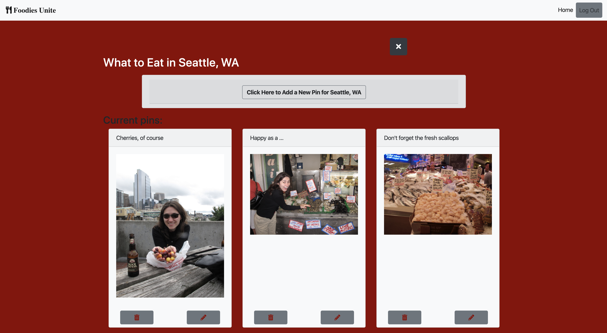
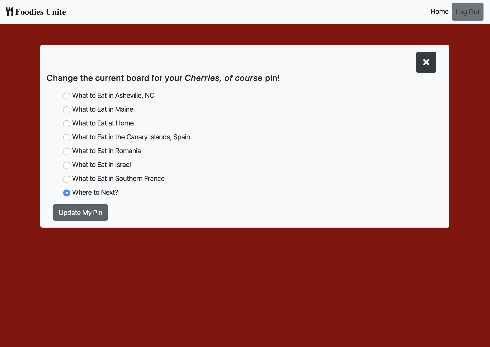

# Foodies Unite

[Check it out here!](https://pinterest-4b62d.web.app/). 

## Description
This project is an exploration into using a Firebase database for user authentication and data management. It is a site similar to a much simplified version of Pinterest, and it includes meal recommendations for various places around the US and the world. Project instructions can be found [here](https://github.com/nss-nightclass-projects/exercise-vault/blob/master/FIREBASE_pinterest.md).

## Background
This project has taught me so much - probably more than any of the projects I have embarked on so far at NSS. From starting to use Firebase for data management, Google authentication, and deployment, to making Promises and learning how to explain the story of such Axios calls to really grasping the relationship between the code in different component and data folders, learning how to debug with a whole new level of complexity and attention to detail, the nuances and getting and setting data and accessing properties of the data returned from Firebase, better understanding the relationship between different data collections through ERDs, and so much more - it has been so exciting to delve in at the beginning of each phase of this project and slowly emerge with new knowledge, tips, and tricks each time.

This project represents our progress during the Data-Driven Apps (and third) stage in our program.

One of the topics I love to follow on social media is food-related news and recipes. Depending on how you define a foodie, I might or might not fall into that category. No, I may have not tried the latest novel restaurants in town. But I do love my CSA box and trying out new recipes from all over the world. Food tours have become a staple when I visit new destinations. And I'd be lying if I didn't admit that I love my book club equally for the books we read and the book-themed dinners we plan for our get-togethers! Hence, my decision to make memorable dining experiences the theme for this project.

## Screenshots
##### Login Page

##### Boards Page

##### Adding a New Board

##### Single Board Page (with Pins)

##### Adding a New Pin

##### Changing the Board on a Pin

## Features
1. Users are authenticated via Google login. 
1. Users can have view multiple boards. 
1. Users can view only their boards; they cannot view other users' boards.
1. Users can access an individual view for each board, which displays all the pins associated with that board. 
1. Users can add new boards.
1. Users can add new pins.
1. Users can change the board on a pin (and, to prevent confusion, they can select only from a list of boards that excludes the pin's current board). Once they save their changes, the new board they selected gets automatically displayed as a means to confirm their changes. 
1. Users can delete boards, which also deletes all the pins associated with the corresponding board. 
1. Users can delete individual pins. 

## Technologies & Tools
Axios, Bootstrap, CSS, ES6 Modules, ESLint, Firebase (for authentication, data management, & deployment), Github (for version control & project planning), HTML5, JavaScript, jQuery, JSON, JSONLint, Lucidchart (for entity relationship diagram (ERD) mapping) moment.js, moqups, REST API, Sass, Webpack

## How to Run
1. Clone down this repo.
1. Make sure you have http-server installed via npm. If not, get it [here](https://www.npmjs.com/package/http-server).
1. On your command line, run `hs -p 9999`.
1. In your browser, navigate to `http://localhost:9999`.

## Firebase Deployment
This project has been deployed with Firebase. 
You can access it [here](https://pinterest-4b62d.web.app/). 
